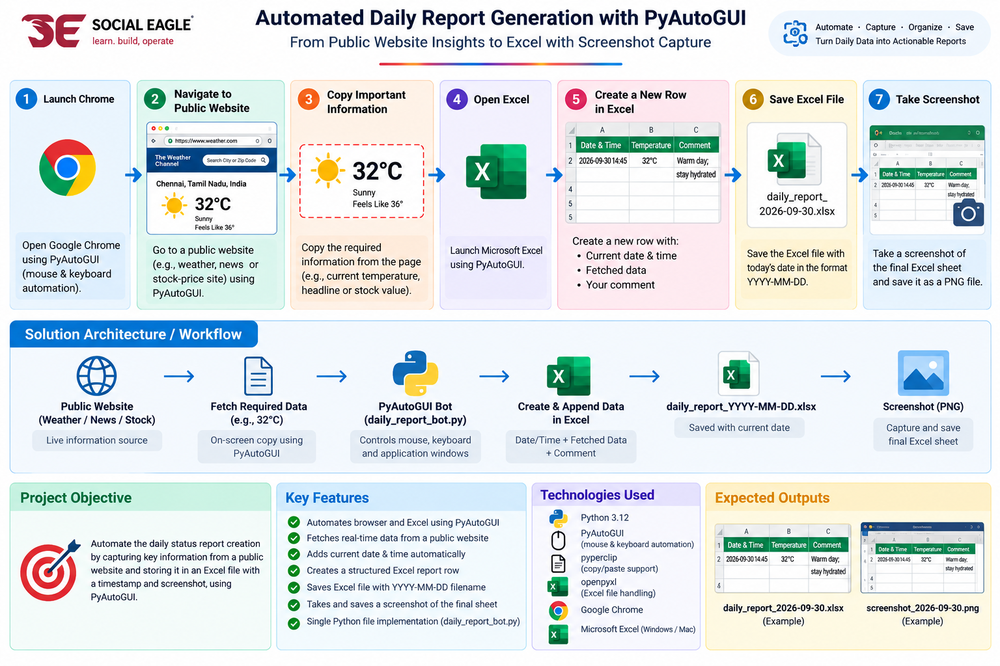
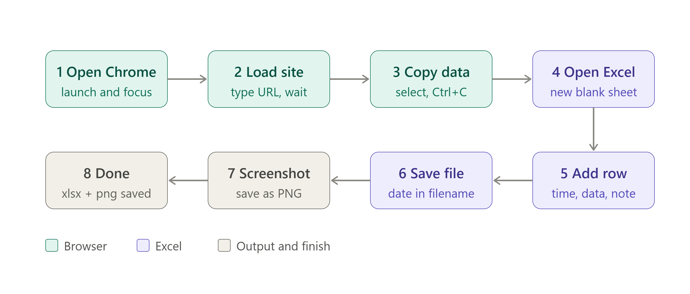
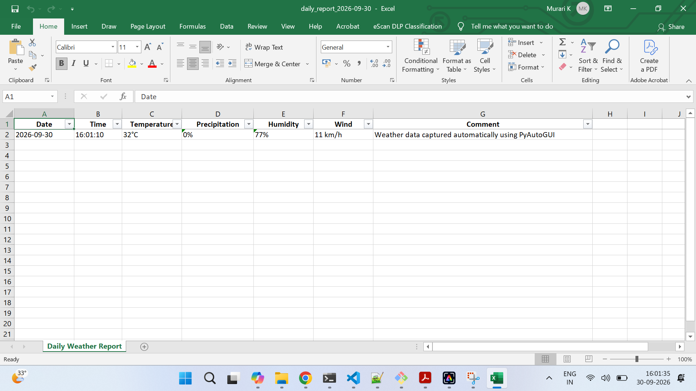

# Automated Daily Report Generation with PyAutoGUI

A Python-based RPA solution that automates the collection of public weather information and generates a structured daily Excel report with an automated screenshot.

## Solution Overview



## Project Objective

Automate a daily status-reporting process by:

- Opening a public website using browser automation
- Capturing relevant information from the webpage
- Extracting useful weather details
- Creating a structured Excel report
- Saving the report with a date-based filename
- Capturing a screenshot of the final report

## Automation Workflow



The bot follows these steps:

1. Launch Google Chrome
2. Navigate to the Chennai weather search
3. Copy webpage information using PyAutoGUI
4. Extract temperature, precipitation, humidity, and wind
5. Create and format an Excel report
6. Save the report using the `YYYY-MM-DD` format
7. Open the generated Excel report
8. Capture a screenshot automatically

## Technology Stack

- **Python 3.12**
- **PyAutoGUI** — mouse and keyboard automation
- **pyperclip** — clipboard data handling
- **OpenPyXL** — Excel workbook creation and formatting
- **Pillow / PyScreeze** — screenshot support
- **Google Chrome**
- **Microsoft Excel**

## Key Features

- Browser automation
- Clipboard-based data extraction
- Dynamic date and time generation
- Automated Excel report creation
- Excel header formatting
- Column width configuration
- Freeze panes
- Excel filtering
- Date-based output filenames
- Automated screenshot capture
- Single Python automation script

## Generated Report

The automation generates a dated Excel file:

```text
daily_report_YYYY-MM-DD.xlsx
```

The report contains:

| Field | Description |
|---|---|
| Date | Report execution date |
| Time | Report execution time |
| Temperature | Current temperature |
| Precipitation | Precipitation probability |
| Humidity | Current humidity |
| Wind | Current wind speed |
| Comment | Automation status |

## Sample Output

### Excel Report



### Generated Files

```text
daily_report_YYYY-MM-DD.xlsx
daily_report_YYYY-MM-DD.png
```

## Project Structure

```text
daily-report-bot/
│
├── .venv/
│
├── docs/
│   ├── architecture.png
│   └── workflow.png
│
├── .gitignore
├── README.md
├── daily_report_bot.py
├── daily_report_YYYY-MM-DD.xlsx
└── daily_report_YYYY-MM-DD.png
```

## Installation

Create a Python 3.12 virtual environment:

```bash
py -3.12 -m venv .venv
```

Activate the environment on Windows:

```bash
.venv\Scripts\activate.bat
```

Install the required packages:

```bash
pip install pyautogui pyperclip openpyxl Pillow PyScreeze
```

## Run the Automation

Execute:

```bash
python daily_report_bot.py
```

The bot will automatically:

```text
Open Chrome
      ↓
Search Chennai Weather
      ↓
Copy webpage content
      ↓
Extract weather information
      ↓
Create Excel report
      ↓
Open Excel
      ↓
Capture screenshot
      ↓
Save output files
```

## RPA Concepts Demonstrated

This project demonstrates practical RPA concepts including:

- Desktop UI automation
- Browser interaction
- Keyboard automation
- Clipboard automation
- Data extraction
- File generation
- Excel automation
- Screenshot automation
- Dynamic file naming
- Basic process orchestration